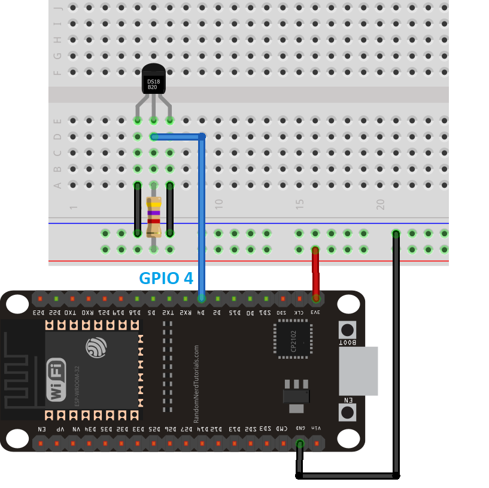

# Sensor Analog Temp

An analog sensor is a sensor that gives you a voltage value that represents the measured value.

### Hardware Used In This Tutorial

- 1 x ESP-WROOM-32 Dev Module
- 1 x Micro USB Cable
- 1 x Breadboard
- 3 x Jumper Wires
- 1 x Analog Temp Sensor
- 1 x 1.k ohm resistor


### Wiring Diagram




### ESP32 Code

```C++

#include <OneWire.h>
#include <DallasTemperature.h>

const int oneWireBus = 4;     

OneWire oneWire(oneWireBus);

DallasTemperature sensors(&oneWire);

void setup() {
  Serial.begin(9600);
  sensors.begin();
}

void loop() {
  sensors.requestTemperatures(); 
  float temperatureC = sensors.getTempCByIndex(0);
  float temperatureF = sensors.getTempFByIndex(0);
  Serial.print(temperatureC);
  Serial.println("ºC");
  Serial.print(temperatureF);
  Serial.println("ºF");
  delay(5000);
}
